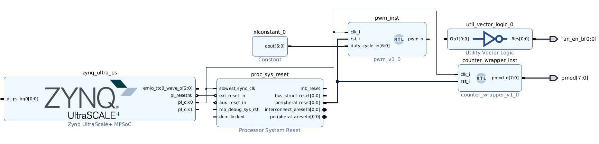

# KV260 infrastructure

## Table of contents
<ol>
    <li><a href="#About-The-Project">About the project</a></li>
    <li><a href="#Prerequisites">Prerequisites</a></li>
    <li><a href="#Usage">Usage</a></li>
    <li><a href="#Contact">Contact</a></li>
</ol>

## About the project <a id="About-The-Project"></a>

The target of this project is to serve as a **baseline for working with AMD KV260** or similar platforms from a **Vivado workflow** perspective. It sets up an infrastructure which consists of the following items:

- **Vivado IP integrator-centric project**: the top level perspective is a block design that allows configuring the **Zynq MPSoC PS block, clocks, resets** as well as any necessary mechanisms to communicate the FPGA design with the PS side (e.g. **interrupts, AXI ports**, etc.). Besides, it integrates the required **RTL user logic**. Several scripts (output/Makefile and ips/platform.tcl) are provided to **automate** the Vivado project generation, the addition of sources and constraints, the building of the platform and the process of synthesising, implementing and generating the final artefacts (bitstream and xsa files).</p>
- **RTL files** (rtl folder): defines the logic to be added in Verilog and/or VHDL. A simple counter is provided as example, **mixing VHDL and Verilog** files with the single purpose of making this infrastructure more solid and reusable. A pwm module is also provided to control the fan from the FPGA when no Linux is running in the PS.
- **Simulation infrastucture**: automates the process of testing the RTL modules basing on **cocotb** framework and **questa** simulator. It is available at tests/sim. With the same purpose of serving as a complete baseline, the testbenches provided test mixed-language modules.

In general, the purpose is simply to provide a baseline to work with KV260 platform, Vivado projects and testbenches while automating every step. Typical projects will involve much more logic, complexity, PS-PL mechanisms, more elaborated testbenches, etc. However, all that is beyond the scope of this project, whose target is to be helpful for me as baseline for coming projects and for those getting introduced to these technologies by providing a simple picture on the different steps involved without adding too much complexity. Note however that it is not intended to be a walkthrough to these technologies (that is a much harder endeavour due to the complexity involved).



## Prerequisites <a id="Prerequisites"></a>

- [AMD Vivado Design Suite](https://www.xilinx.com/products/design-tools/vivado.html) for generating the project, the output artefacts, programming the FPGA, etc.
- [cocotb](https://www.cocotb.org/) as testbenching framework.
- [Questa advanced simulator](https://eda.sw.siemens.com/en-US/ic/questa/simulation/advanced-simulator/) as simulator. Opensource alternatives such as [GHDL](https://github.com/ghdl/ghdl) + [gtkwave](https://github.com/gtkwave/gtkwave) are also good options (they would require minor modifications in the test Makefile).

## Usage <a id="Usage"></a>

**Testbenchs**:

```
cd tests/sim/test_X
make # vsim.wlf (waveform file) will be generated; it can be visualized from Questa
```

The Makefile can be changed as needed to include new sources, change the simulator, etc.

**Project generation**:

```
cd output
source /opt/Xilinx/Vivado/2022.1/settings64.sh
make # build the Vivado project and generate bitstream and xsa
make vivado # build the Vivado project and opens it from Vivado GUI
```

See output/Makefile for more details about usage and parameters.

Note that Zynq platforms require PS initialisation so that some resources available from the PL side (such as PLn clocks) work. The simplest option is to create a baremetal platfrom in Vitis from the xsa generated and load a simple application. 

## Contact <a id="Contact"></a>

[![LinkedIn][linkedin-shield]][linkedin-url]


<p align="right">(<a href="#top">back to top</a>)</p>

<!-- README built based on this nice template: https://github.com/othneildrew/Best-README-Template -->

<!-- MARKDOWN LINKS & IMAGES -->

[linkedin-shield]: https://img.shields.io/badge/LinkedIn-0077B5?style=for-the-badge&logo=linkedin&logoColor=white
[linkedin-url]: https://www.linkedin.com/in/juan-manuel-reina-mu%C3%B1oz-56329b130/
