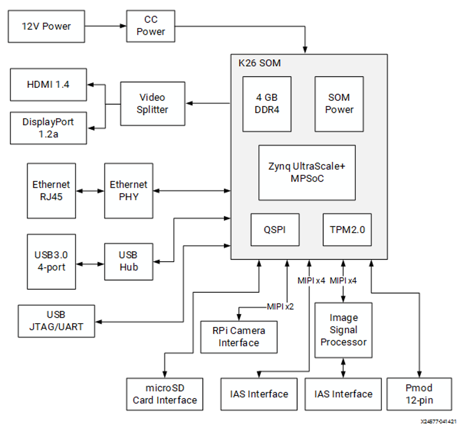
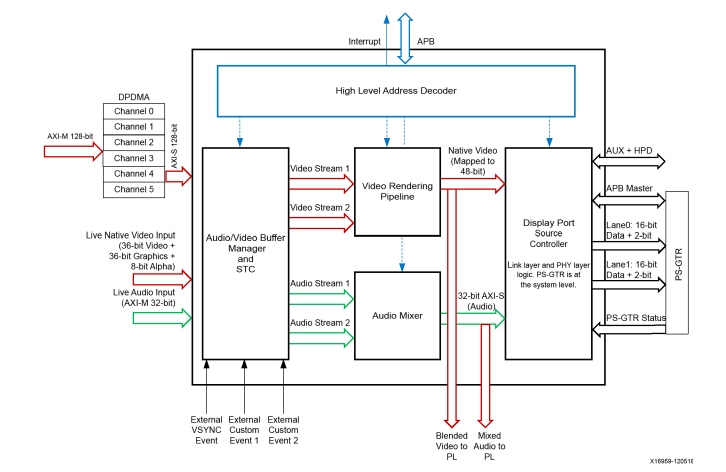
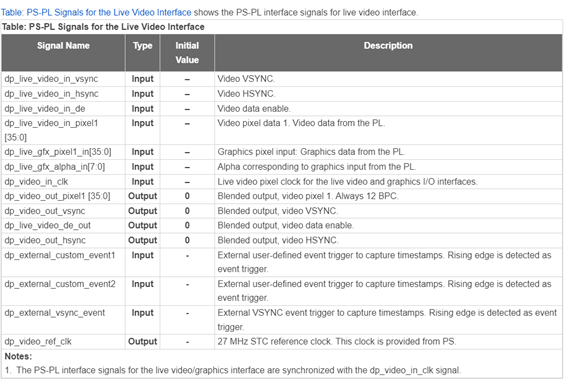
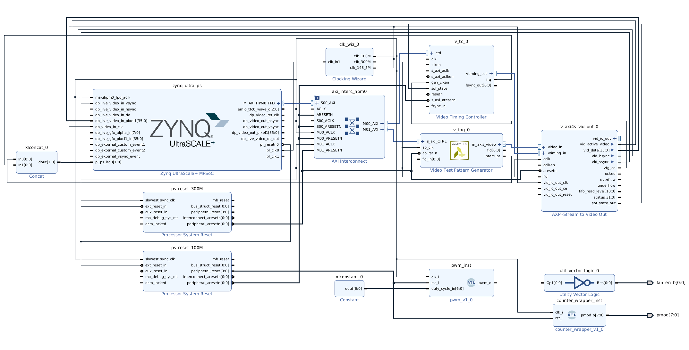
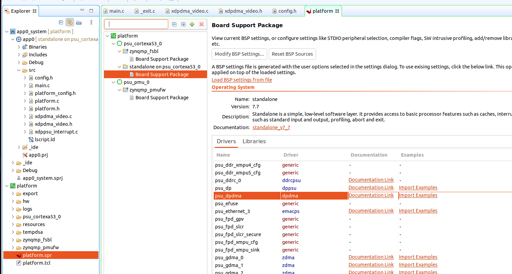

# Controlling video output from PL with Video Test Pattern Generator

## Table of contents
<ol>
    <li><a href="#About-The-Project">About the project</a></li>
    <li><a href="#Theoretical-Understanding">Theoretical understanding</a></li>
    <li><a href="#Hardware-Design">Hardware Design</a></li>
    <li><a href="#Software-design">Software design</a></li>
    <li><a href="#Prerequisites">Prerequisites</a></li>
    <li><a href="#Usage">Usage</a></li>
    <li><a href="#References">References</a></li>
    <li><a href="#Contact">Contact</a></li>
</ol>

## About the project <a name="About-The-Project"></a>

The AMD KV260 Vision AI Starter Kit is a platform designed for applications targeting video, featuring 2 video outputs (HDMI 1.4 and DisplayPort 1.2a) and 3 MIPI sensor interfaces (2 IAS MIPI interface and 1 Raspberry Pi camera interface). The goal of this project is to get introduced to the video output interfaces in this platform and to achieve visual results on an external screen through a video stream controlled from the FPGA side. While a pre-built Ubuntu image is already set-up to output video from the Operating System, the motivation is to gain knowledge on configuring and controlling the video output at low level in order to leverage the KV260 FPGA capabilities.

To simplify the process, the Video Test Pattern Generator (VTPG) IP is used to drive the video output.


## Theoretical understanding <a name="Theoretical-Understanding"></a>

From the board perspective, the KV260 comes with 2 video outputs (HDMI 1.4 and DisplayPort 1.2a), accessed through an intermediate Video Splitter that duplicates the video output through both HDMI and DP interfaces.



From the SoC perspective, the KV260 is based on Zynq Ultrascale+ architecture, which features a DisplayPort Controller. This is described in the corresponding section in the official documentation (Zynq UltraScale+ Device Technical Reference Manual). According to this: "the DisplayPort controller provides a flexible display output with direct memory access (DMA), centralized buffer manager, rendering block and audio mixer block. It can source data from memory (non-live input) or the (live input) programmable logic (PL). The DisplayPort processes data, and sends it out through the DisplayPort source-only controller block to external display devices or to the PL (live output). The DisplayPort pipeline consists of the DisplayPort direct memory access (DMA) for fetching data from memory, a centralized buffer manager, a display rendering block, an audio mixer block, and the DisplayPort source controller, along with the PS-GTR block. The DisplayPort pipeline supports an ultra-high definition (UHD) aggregate video bandwidth of 30 Hz."



From the FPGA (PL) perspective, the documentation states that the PL can access the DP controller via its live input. A set of signals interconnects the PS and the PL in order to provide the latter access to the display controller. The current table shows those signals from the PS perspective:



In addition to the hardware perspective, some details on video timing are relevant to properly handle the video output. There are several timing standards for video (CVT, CEA-861, DMT, etc.) defined by VESA and that define video timing / blanking. Each display may adhere to a distinct set of standards. This information is required in order to determine the pixel clock frequency in our design. Some useful and tested configurations - pixel clock frequencies, in compliance with video timing standards CEA-861 and DMT (that resulted to work with the screens used for testing), are:

| Resolution | V Sync (FPS) | Standards | Pixel clock frequency (MHz) |
| ------ | ------ | ------ | ------ |
| 720p (1280x720) | 60 | CEA-861 and DMT | 74.25 |
| 1080p (1920x1080) | 60 | CEA-861 and DMT |148.5 |
| UltraHD (3840x2160) | 30 | CEA-861 and DMT | 297 |

In order to calculate the pixel clock frequency, the total frame resolution (including active and blanking areas) must be known. An example to determine pixel clock frequency for 1920 x 1080 @ 60 fps in compliance with CEA-861 is provided below:
```
H Total = 2200
H Active = 1920
V Total = 1125
V Active = 1080
V Sync = 60 fps
pixel_clock_freq = num_pixels_per_frame * num_frames_per_second = H_Total * V_Total * V_Sync = 2200 * 1125 * 30 = 148.5 MHz
```

## Hardware design <a name="Hardware-Design"></a>

Due to the fact that the main purpose is to achieve an early visual output running on the hardware, some useful pre-built IPs are used and connected. In particular, the video frames is generated by the AMD `Video Test Pattern Generator` and connected to the AMD `AXI4-Stream to Video Out`, with the video timing handled by the AMD `Video Timing Controller`. An overview of the block design is shown below:



The full block design configuration is scripted in ips/platform.tcl. However, it is relevant to highlight some bits:
- In order to enable the access to the DisplayPort controller Live interface from the PL, `Live Video` must be enabled in the `Zynq UltraScale+ MPSoC` block (under `PS-PL Configuration/General/Others/`)
- The `Video Timing Controller` IP is configured via its AXI ctrl interface from a baremetal application running on the A53. `Include AXI4-Lite interface` option must be enabled.
- The `Video Test Pattern Generator` IP is configured via its AXI s_axi_CTRL interface from a baremetal application running on the A53.
- The `AXI4-Stream to Video Out` IP is configured to work with `Native Video Output Component Width = 12` and `Clock Mode = Independent`.
- Configuration related to resolution an FPS:
  - `Video Timing Controller` is configured at `Max clocks Per Line = 8192` and `Max Lines Per Frame` to support **up to UltraHD** (3840x2160) resolution. Blanking generation is enabled to meet video timing. `Video Mode` default value is set to `1080p`, though this might be changed from the software application.
  - `Video Test Pattern Generator` is configured with `Maximum Number of Columns = 4096` and `Maximum Number of Rows = 2160` to support **up to UltraHD** (3840x2160) resolution. The actual resolution might be changed from the software application.
  - The pixel clock signal (which feeds `zynq_ultra_ps/dp_video_in_clk` and `AXI4-Stream_to_Video_Out/vid_io_out_clk`) is driven by the `Clocking Wizard` IP and **must** be configured at the frequency required for the output resolution. Therefore, **this design does not allow changing the resolution at runtime without modifying this frequency and regenerating the bitstream**. The default frequency selected is `148.5 MHz (for 1080p @ 60 fps)`

## Software design <a name="Software-design"></a>

In order to initialise, configure and run the video components (Video Test Pattern Generator (VTPG), Video Timing Controller (VTC) and DisplayPort Controller (DPPSU)), a standalone / baremetal application is built to run on the A53. It makes use under the hood of the psu_dpdma example provided by Xilinx to control the DisplayPort controller, which is based on the xdppsu DisplayPort standalone driver.

The source files are provided under sw/app_a53_standalone_config_video:
- main.c: initialises the platform, configures the video components and enables them.
- config.h: allows selecting the video mode used (must match the configuration used in the FPGA components including the pixel clock frequency).
- xdpdma_video.h/c and xdppsu_interrupt.c: provides useful functions to configure the DisplayPort controller. 

## Prerequisites <a name="Prerequisites"></a>

- [AMD Vivado Design Suite](https://www.xilinx.com/products/design-tools/vivado.html) for generating the project, the output artefacts, programming the FPGA, etc.
- [cocotb](https://www.cocotb.org/) as testbenching framework.
- [Questa advanced simulator](https://eda.sw.siemens.com/en-US/ic/questa/simulation/advanced-simulator/) as simulator. Opensource alternatives such as [GHDL](https://github.com/ghdl/ghdl) + [gtkwave](https://github.com/gtkwave/gtkwave) are also good options (they would require minor modifications in the test Makefile).
- [AMD KV260](https://www.xilinx.com/products/som/kria/kv260-vision-starter-kit.html)
- External monitor
- HDMI cable

## Usage <a name="Usage"></a>

**Vivado Project: configuration**:

Configure clk_wiz_0 clock 3 in ips/platform.tcl (or directly from Vivado IP integrator) so that the pixel clock frequency matches the requirements of the video mode used. By default it is set to 148.5 MHz (1080p @ 60Hz)

**Vivado Project: build the project and generate bitstream and xsa platform file**:

```
cd output
source /opt/Xilinx/Vivado/2022.1/settings64.sh
make # build the Vivado project and generate bitstream and xsa
make vivado # build the Vivado project and opens it from Vivado GUI
```

See output/Makefile for more details about usage and parameters.

**Vitis Project**:

- From Vitis IDE, build a platform project based on the xsa generated from the previous step.
- On top of that platform, build a standalone application project for the A53 core based on HelloWorld template.
- Import the sources from sw/app_a53_standalone_config_video to the application project.
- Remove original HelloWorld.c
- Modify `VIDEO_MODE_CONFIG` to match the video mode used.
- Note: the original dpdma example of Xilinx can be generated from the platform as shown below, clicking "Import Examples":

- Note: `xdpdma_video.c` includes some modifications with respect to the original example to select a video mode according to the value chosen in `config.h` and to select `XAVBUF_VIDSTREAM1_LIVE` in `XAVBuf_InputVideoSelect` function for enabling live input (from the FPGA) in the DP controller.
- Compile all and upload the resulting binary into the KV260. As initialisation procedure, `psu_init` must be used instead of the standard FSBL flow to properly boot up.

## References <a name="References"></a>

- [Zynq UltraScale+ Device Technical Reference Manual](https://docs.xilinx.com/r/en-US/ug1085-zynq-ultrascale-trm). In particular, section `DisplayPort Controller` provides relevant information on the underlying hardware in charge of controlling the video output.
- [Kria KV260 Vision AI Starter Kit User Guide (UG1089)](https://docs.xilinx.com/r/en-US/ug1089-kv260-starter-kit/Summary)
- [Kria KV260 Vision AI Starter Kit Data Sheet(DS986)](https://docs.xilinx.com/r/en-US/ds986-kv260-starter-kit/Summary)
- [Kria KV260 Vision AI Starter Kit Applications](https://xilinx.github.io/kria-apps-docs/kv260/2022.1/build/html/index.html)
- [Kria SOM Carrier Card Design Guide (UG1091)](https://docs.xilinx.com/r/en-US/ug1091-carrier-card-design/MIO-Signals)
- [Kria K26 SOM Data Sheet(DS987)](https://docs.xilinx.com/r/en-US/ds987-k26-som/Overview)
- [AMD Video Series and Blog Posts](https://support.xilinx.com/s/question/0D52E00006hpsS0SAI/xilinx-video-series-and-blog-posts?language=en_US)
- [AMD LogiCORE™ IP Video Test Pattern Generator](https://docs.xilinx.com/r/en-US/pg103-v-tpg/Video-Test-Pattern-Generator-v8.2-LogiCORE-IP-Product-Guide)
- [AMD LogiCORE™ IP Video Timing Controller](https://docs.xilinx.com/r/en-US/pg016_v_tc/Video-Timing-Controller-v6.2-LogiCORE-IP-Product-Guide)
- [AMD LogiCORE™ IP AXI4-Stream to Video Out](https://docs.xilinx.com/v/u/en-US/pg044_v_axis_vid_out)
- Coordinated Video Timing, CVT:
	- [Coordinated Video Timing, CVT](https://en.wikipedia.org/wiki/Coordinated_Video_Timings)
    - [Video Timings Calculator](https://tomverbeure.github.io/video_timings_calculator)
	- [Table with timing values for several formats](https://www.realdigital.org/doc/2a980fe08a4181a22e07241998c375a2)
- MicroZed Chronicles: DisplayPort Controller (Adam Taylor)
    - [Part 1 (HW)](https://www.hackster.io/news/microzed-chronicles-displayport-controller-part-one-25734db13fad)
    - [Part 2 (SW)](https://www.hackster.io/news/microzed-chronicles-displayport-controller-part-two-1fa042f7a242)
- 4K TPG Video Streaming in Kria KV260 (Nikil Thapa)
    - [Part 1 (HW)](https://www.hackster.io/nikilthapa/4k-tpg-video-streaming-in-kria-kv260-baremetal-part-1-c0c9d6)
    - [Part 2 (SW)](https://www.hackster.io/nikilthapa/4k-tpg-video-streaming-in-kria-kv260-baremetal-part-2-62fca5)

## Contact <a name="Contact"></a>

[![LinkedIn][linkedin-shield]][linkedin-url]


<p align="right">(<a href="#top">back to top</a>)</p>

<!-- README built based on this nice template: https://github.com/othneildrew/Best-README-Template -->

<!-- MARKDOWN LINKS & IMAGES -->

[linkedin-shield]: https://img.shields.io/badge/LinkedIn-0077B5?style=for-the-badge&logo=linkedin&logoColor=white
[linkedin-url]: https://www.linkedin.com/in/juan-manuel-reina-mu%C3%B1oz-56329b130/
