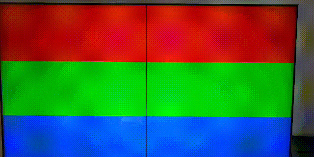
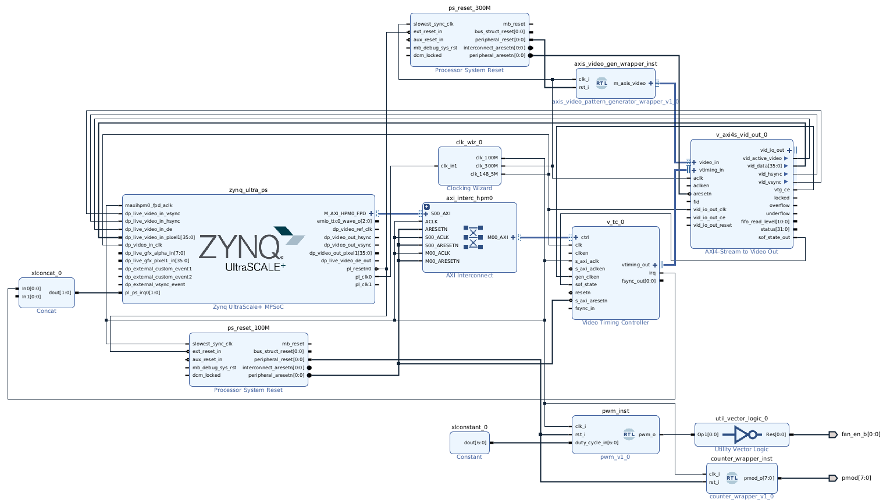
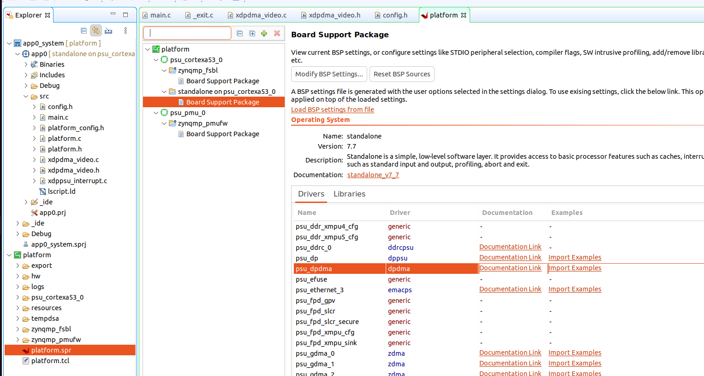

# Controlling video output from PL with Video Test Pattern Generator

## Table of contents
<ol>
    <li><a href="#About-The-Project">About the project</a></li>
    <li><a href="#Theoretical-Understanding">Theoretical understanding</a></li>
    <li><a href="#Debugging-the-VTPG-design">Debugging the VTPG design</a></li>
    <li><a href="#Hardware-Design">Hardware Design</a></li>
    <li><a href="#Software-design">Software design</a></li>
    <li><a href="#Prerequisites">Prerequisites</a></li>
    <li><a href="#Usage">Usage</a></li>
    <li><a href="#References">References</a></li>
    <li><a href="#Contact">Contact</a></li>
</ol>

## About the project <a id="About-The-Project"></a>

Aiming at acquiring control from the PL on the video output in the AMD KV260 platform, the current project focuses first on understanding the AXI Stream (output of the `Video Test Pattern Generator` IP, driving the input of the `AXI4-Stream to Video Out` IP) by reading the documentation and debugging via the AMD `ILA` IP and then building a basic HDL module to generate a simple video pattern to validate the understanding and implementation of the original video generator.



## Theoretical understanding <a id="Theoretical-Understanding"></a>

Regarding the official documentation, I focus on `AMD LogiCORE™ IP AXI4-Stream to Video Out` document, chapeter `Chapter 2: Product Specification`, section `AXI4-Stream Interface`. Below a summary with the main points of interest:
- Video input to the `AXI4-Stream to Video Out` IP is provided through an AXI Stream interface, consisting of:
  - `tvalid`: 1-bit wide input, indicating valid data.
  - `tuser`: 1-bit wide input, indicating start of frame `SOF`. "The SOF pulse is 1 valid transaction wide, and must coincide with the first pixel of the frame".
  - `tlast`: 1-bit wide input, indicating end of line `EOL`. "The EOL pulse is 1 valid transaction wide, and must coincide with the last pixel of a scanline".
  - `tready`: 1-bit wide output, indicating whether or not the IP is ready to receive new data.
  - `tdata`: N*8-bit wide input, containing the pixel data to be transmitted. Further explanation is provided in the documentation regarding component order, packing, padding, trimmering.
  - "Data is consumed at the rising edge of `aclk` if `ready`, `valid`and `aclken` are all high. Once `tvalid` is asserted, no interface signals (except `tready`) may change value until the transaction completes".
  - Blanking is not transferred through this interface (`Video Timing Controller` IP will take charge of it).
- Video Timing Interface is controlled from `Video Timing Controller` IP and is not of our interest so far.

Block diagram view of `AXI4-Stream to Video Out`:


Block configuration of `AXI4-Stream to Video Out`:


## Debugging the VTPG design <a id="Debugging-the-VTPG-design"></a>

In order to dig deeper in understanding the AXI Stream video interface, I add some probes and connect the `ILA` to the design of the previous project (see [1_video_tpg_dp](https://github.com/juanma-rm/kv260_video_from_pl/tree/main/1_video_tpg_dp)), where the video generated in in RGB colour space. Below some screenshots on the waveforms:

- Triggering at SOF:


- Triggering at SOF (zoom in):


- Triggering at EOL (zoom in):


- Triggering at EOL (zoom in):


Considerations: the interface debugged is transmitting 24-bit RGB video (8 bits per components)

If we remember the previous project, the order of the vertical bars in the background is as follows: white, cyan, yellow, green, magenta, blue, red and black. Mapping that order to the one seen in the previous screenshots:
- First vertical bar in background: white
  - Debugging. SOF corresponds also to a SOL. When triggering at that condition, the first value observed in tdata is 0xffffff (first component = 0xff, second component = 0xff, third component = 0xff).
  - This matches the output video (white is the sum of the three components).
- Second vertical bar in background: cyan
  - Debugging. After many cycles transmitting the previous value, the next value of tdata is 0xff00ff (first component = 0xff, second component = 0x00, third component = 0xff)
  - As cyan is green + blue, it follows that the component in the middle **(bits 15-8) should correspond to red**.
- Third vertical bar in background: yellow
  - Debugging. After many cycles transmitting the previous value, the next value of tdata is 0x00ffff (first component = 0x00, second component = 0xff, third component = 0xff)
  - As yellow is green + red, it follows that the component in the MSB **(bits 23-16) should correspond to blue*. And bringing the last conclusion, **bits 7-0 should correspond to green**.
- Second to last vertical bar in background: red
  - Debugging. Looking now at EOL, the value of tdata for this bar is 0x00ff00 (first component = 0x00, second component = 0xff, third component = 0x00)
  - Therefore, it follows that the component in the middle (bits 15-8) should correspond to red.
- Last vertical bar in background: black
  - Debugging. After many cycles transmitting the previous value, the value of tdata for this bar is 0x000000 (first component = 0x00, second component = 0x00, third component = 0x00)
  - This matches the output video (black is the absence of the three components).

Video output:


RGB component mix:


Summary:

| Bits in tdata | Colour |
| ------- | ------ |
| 23-15   | B |
| 15-08   | R |
| 07-00   | G |

However, this does not match some of the figures provided in `AMD LogiCORE™ IP AXI4-Stream to Video Out` document. Either I am missing some configuration, detail or internal component swapping or the order shown in the figures does not match the one of the actual IP behaviour. In any case I will stick to the current configuration and the experimental conclusions to keep progressing to the project goal.

## Hardware design <a id="Hardware-Design"></a>

I build now a simple video generator in VHDL to validate the previous knowledge. It consists of a static background with three horizontal wide bars (red, green and blue from top to bottom, respectively) and a 5 pixel wide black vertical bar moving from left to right at a rate of one pixel per frame. The rest of the design is the same as in the [previous part](https://github.com/juanma-rm/kv260_video_from_pl/tree/main/1_video_tpg_dp)

The resulting Vivado block diagram is shown below.



Below a short capture of the result:


## Software design <a id="Software-design"></a>

In this case the software also remains similar to the [previous part](https://github.com/juanma-rm/kv260_video_from_pl/tree/main/1_video_tpg_dp), with the single difference of removing the configuration related to the `Video Test Pattern Generator` IP, which now is not part of the design as it has been replaced by the custom video generator (not requiring any configuration from the processor side).

## Prerequisites <a id="Prerequisites"></a>

- [AMD Vivado Design Suite](https://www.xilinx.com/products/design-tools/vivado.html) for generating the project, the output artefacts, programming the FPGA, etc.
- [cocotb](https://www.cocotb.org/) as testbenching framework.
- [Questa advanced simulator](https://eda.sw.siemens.com/en-US/ic/questa/simulation/advanced-simulator/) as simulator. Opensource alternatives such as [GHDL](https://github.com/ghdl/ghdl) + [gtkwave](https://github.com/gtkwave/gtkwave) are also good options (they would require minor modifications in the test Makefile).
- [AMD KV260](https://www.xilinx.com/products/som/kria/kv260-vision-starter-kit.html)
- External monitor
- HDMI cable

## Usage <a id="Usage"></a>

**Vivado Project: configuration**:

Configure clk_wiz_0 clock 3 in ips/platform.tcl (or directly from Vivado IP integrator) so that the pixel clock frequency matches the requirements of the video mode used. By default it is set to 148.5 MHz (1080p @ 60Hz)

**Vivado Project: build the project and generate bitstream and xsa platform file**:

```
cd output
source /opt/Xilinx/Vivado/2022.1/settings64.sh
make # build the Vivado project and generate bitstream and xsa
make vivado # build the Vivado project and opens it from Vivado GUI
```

See output/Makefile for more details about usage and parameters.

**Vitis Project**:

- From Vitis IDE, build a platform project based on the xsa generated from the previous step.
- On top of that platform, build a standalone application project for the A53 core based on HelloWorld template.
- Import the sources from sw/app_a53_standalone_config_video to the application project.
- Remove original HelloWorld.c
- Modify `VIDEO_MODE_CONFIG` in `config.h` to match the video mode used.
- Note: the original dpdma example of Xilinx can be generated from the platform as shown below, clicking "Import Examples":

- Note: `xdpdma_video.c` includes some modifications with respect to the original example to select a video mode according to the value chosen in `config.h` and to select `XAVBUF_VIDSTREAM1_LIVE` in `XAVBuf_InputVideoSelect` function for enabling live input (from the FPGA) in the DP controller.
- Compile all and upload the resulting binary into the KV260. As initialisation procedure, `psu_init` must be used instead of the standard FSBL flow to properly boot up.


## References <a id="References"></a>

- [Zynq UltraScale+ Device Technical Reference Manual](https://docs.xilinx.com/r/en-US/ug1085-zynq-ultrascale-trm). In particular, section `DisplayPort Controller` provides relevant information on the underlying hardware in charge of controlling the video output.
- [Kria KV260 Vision AI Starter Kit User Guide (UG1089)](https://docs.xilinx.com/r/en-US/ug1089-kv260-starter-kit/Summary)
- [Kria KV260 Vision AI Starter Kit Data Sheet(DS986)](https://docs.xilinx.com/r/en-US/ds986-kv260-starter-kit/Summary)
- [Kria KV260 Vision AI Starter Kit Applications](https://xilinx.github.io/kria-apps-docs/kv260/2022.1/build/html/index.html)
- [Kria SOM Carrier Card Design Guide (UG1091)](https://docs.xilinx.com/r/en-US/ug1091-carrier-card-design/MIO-Signals)
- [Kria K26 SOM Data Sheet(DS987)](https://docs.xilinx.com/r/en-US/ds987-k26-som/Overview)
- [AMD Video Series and Blog Posts](https://support.xilinx.com/s/question/0D52E00006hpsS0SAI/xilinx-video-series-and-blog-posts?language=en_US)
- [AMD LogiCORE™ IP Video Test Pattern Generator](https://docs.xilinx.com/r/en-US/pg103-v-tpg/Video-Test-Pattern-Generator-v8.2-LogiCORE-IP-Product-Guide)
- [AMD LogiCORE™ IP Video Timing Controller](https://docs.xilinx.com/r/en-US/pg016_v_tc/Video-Timing-Controller-v6.2-LogiCORE-IP-Product-Guide)
- [AMD LogiCORE™ IP AXI4-Stream to Video Out](https://docs.xilinx.com/v/u/en-US/pg044_v_axis_vid_out)
- Coordinated Video Timing, CVT:
	- [Coordinated Video Timing, CVT](https://en.wikipedia.org/wiki/Coordinated_Video_Timings)
    - [Video Timings Calculator](https://tomverbeure.github.io/video_timings_calculator)
	- [Table with timing values for several formats](https://www.realdigital.org/doc/2a980fe08a4181a22e07241998c375a2)
- MicroZed Chronicles: DisplayPort Controller (Adam Taylor)
    - [Part 1 (HW)](https://www.hackster.io/news/microzed-chronicles-displayport-controller-part-one-25734db13fad)
    - [Part 2 (SW)](https://www.hackster.io/news/microzed-chronicles-displayport-controller-part-two-1fa042f7a242)
- 4K TPG Video Streaming in Kria KV260 (Nikil Thapa)
    - [Part 1 (HW)](https://www.hackster.io/nikilthapa/4k-tpg-video-streaming-in-kria-kv260-baremetal-part-1-c0c9d6)
    - [Part 2 (SW)](https://www.hackster.io/nikilthapa/4k-tpg-video-streaming-in-kria-kv260-baremetal-part-2-62fca5)

## Contact <a id="Contact"></a>

[![LinkedIn][linkedin-shield]][linkedin-url]


<p align="right">(<a href="#top">back to top</a>)</p>

<!-- README built based on this nice template: https://github.com/othneildrew/Best-README-Template -->

<!-- MARKDOWN LINKS & IMAGES -->

[linkedin-shield]: https://img.shields.io/badge/LinkedIn-0077B5?style=for-the-badge&logo=linkedin&logoColor=white
[linkedin-url]: https://www.linkedin.com/in/juan-manuel-reina-mu%C3%B1oz-56329b130/
