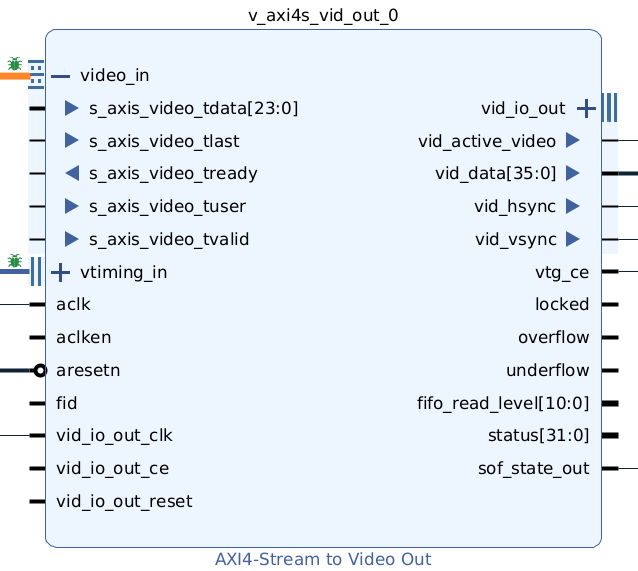
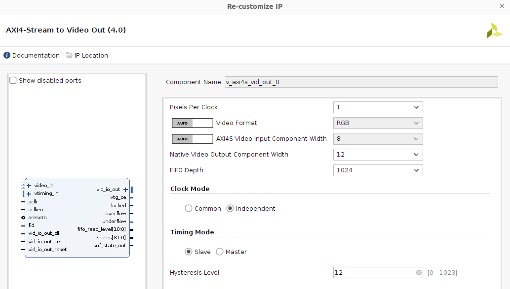
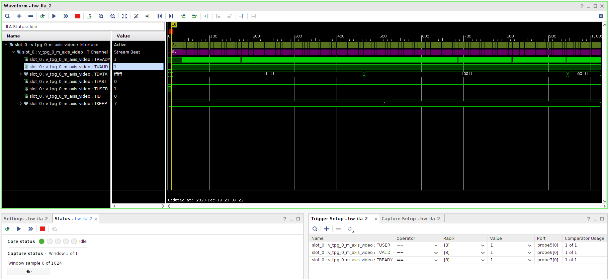
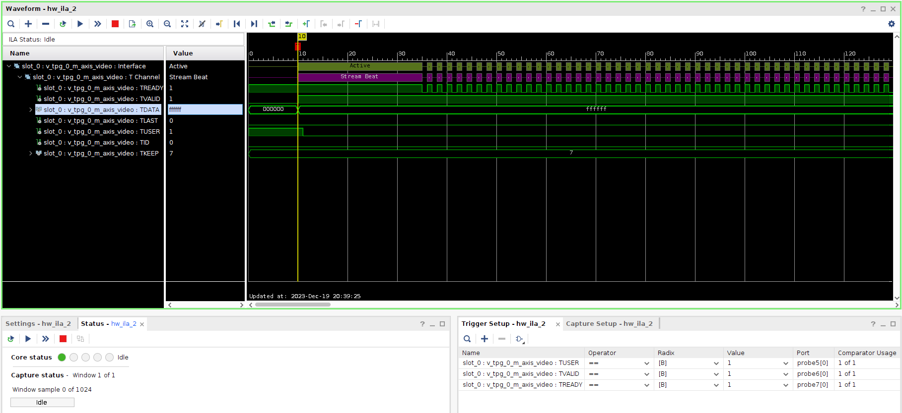
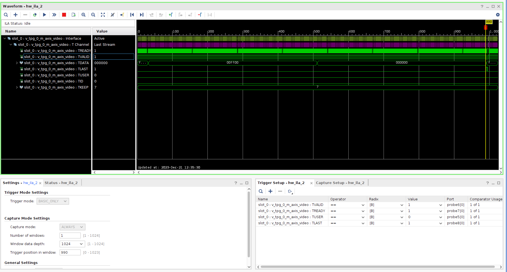
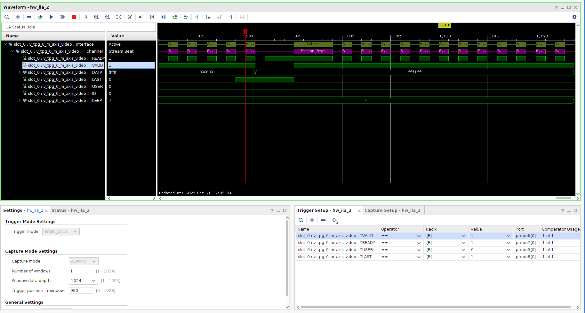
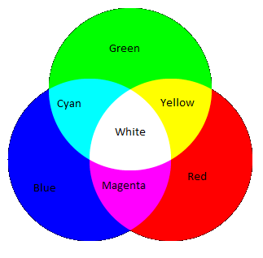

# Controlling video output from PL with Video Test Pattern Generator

## Table of contents
<ol>
    <li><a href="#About-The-Project">About the project</a></li>
    <li><a href="#Theoretical-Understanding">Theoretical understanding</a></li>
    <li><a href="#Debugging-the-VTPG-design">Debugging the VTPG design</a></li>
    <li><a href="#Hardware-Design">Hardware Design</a></li>
    <li><a href="#Software-design">Software design</a></li>
    <li><a href="#Prerequisites">Prerequisites</a></li>
    <li><a href="#Usage">Usage</a></li>
    <li><a href="#References">References</a></li>
    <li><a href="#Contact">Contact</a></li>
</ol>

## About the project 

Aiming at acquiring control from the PL on the video output in the AMD KV260 platform, the current project focuses first on understanding the AXI Stream (output of the `Video Test Pattern Generator` IP, driving the input of the `AXI4-Stream to Video Out` IP) by reading the documentation and debugging via the AMD `ILA` IP and then building a basic HDL module to generate a simple video pattern to validate the understanding and implementation of the original video generator.

## Theoretical understanding 

Regarding the official documentation, I focus on `AMD LogiCORE™ IP AXI4-Stream to Video Out` document, chapeter `Chapter 2: Product Specification`, section `AXI4-Stream Interface`. Below a summary with the main points of interest:
- Video input to the `AXI4-Stream to Video Out` IP is provided through an AXI Stream interface, consisting of:
  - `tvalid`: 1-bit wide input, indicating valid data.
  - `tuser`: 1-bit wide input, indicating start of frame `SOF`. "The SOF pulse is 1 valid transaction wide, and must coincide with the first pixel of the frame".
  - `tlast`: 1-bit wide input, indicating end of line `EOL`. "The EOL pulse is 1 valid transaction wide, and must coincide with the last pixel of a scanline".
  - `tready`: 1-bit wide output, indicating whether or not the IP is ready to receive new data.
  - `tdata`: N*8-bit wide input, containing the pixel data to be transmitted. Further explanation is provided in the documentation regarding component order, packing, padding, trimmering.
  - "Data is consumed at the rising edge of `aclk` if `ready`, `valid`and `aclken` are all high. Once `tvalid` is asserted, no interface signals (except `tready`) may change value until the transaction completes".
  - Blanking is not transferred through this interface (`Video Timing Controller` IP will take charge of it).
- Video Timing Interface is controlled from `Video Timing Controller` IP and is not of our interest so far.

Block diagram view of `AXI4-Stream to Video Out`:

Block configuration of `AXI4-Stream to Video Out`:

## Debugging the VTPG design 

In order to dig deeper in understanding the AXI Stream video interface, I add some probes and connect the `ILA` to the design of the previous project (see [1_video_tpg_dp](https://github.com/juanma-rm/kv260_video_from_pl/tree/main/1_video_tpg_dp)), where the video generated in in RGB colour space. Below some screenshots on the waveforms:

- Triggering at SOF:

- Triggering at SOF (zoom in):

- Triggering at EOL (zoom in):

- Triggering at EOL (zoom in):

Considerations: the interface debugged is transmitting 24-bit RGB video (8 bits per components)

If we remember the previous project, the order of the vertical bars in the background is as follows: white, cyan, yellow, green, magenta, blue, red and black. Mapping that order to the one seen in the previous screenshots:
- First vertical bar in background: white
  - Debugging. SOF corresponds also to a SOL. When triggering at that condition, the first value observed in tdata is 0xffffff (first component = 0xff, second component = 0xff, third component = 0xff).
  - This matches the output video (white is the sum of the three components).
- Second vertical bar in background: cyan
  - Debugging. After many cycles transmitting the previous value, the next value of tdata is 0xff00ff (first component = 0xff, second component = 0x00, third component = 0xff)
  - As cyan is green + blue, it follows that the component in the middle **(bits 15-8) should correspond to red**.
- Third vertical bar in background: yellow
  - Debugging. After many cycles transmitting the previous value, the next value of tdata is 0x00ffff (first component = 0x00, second component = 0xff, third component = 0xff)
  - As yellow is green + red, it follows that the component in the MSB **(bits 23-16) should correspond to blue*. And bringing the last conclusion, **bits 7-0 should correspond to green**.
- Second to last vertical bar in background: red
  - Debugging. Looking now at EOL, the value of tdata for this bar is 0x00ff00 (first component = 0x00, second component = 0xff, third component = 0x00)
  - Therefore, it follows that the component in the middle (bits 15-8) should correspond to red.
- Last vertical bar in background: black
  - Debugging. After many cycles transmitting the previous value, the value of tdata for this bar is 0x000000 (first component = 0x00, second component = 0x00, third component = 0x00)
  - This matches the output video (black is the absence of the three components).

Video output:

RGB component mix:

Summary:

| Bits in tdata | Colour |
| ------- | ------ |
| 23-15   | B |
| 15-08   | R |
| 07-00   | G |

However, this does not match some of the figures provided in `AMD LogiCORE™ IP AXI4-Stream to Video Out` document. Either I am missing some configuration, detail or internal component swapping or the order shown in the figures does not match the one of the actual IP behaviour. In any case I will stick to the current configuration and the experimental conclusions to keep progressing to the project goal.

## Hardware design 

@todo

## Software design 

@todo

## Prerequisites 

@todo

## Usage 

@todo

## References 

@todo

## Contact 

[![LinkedIn][linkedin-shield]][linkedin-url]

(<a href="#top">back to top</a>)

<!-- README built based on this nice template: https://github.com/othneildrew/Best-README-Template -->

<!-- MARKDOWN LINKS & IMAGES -->

[linkedin-shield]: https://img.shields.io/badge/LinkedIn-0077B5?style=for-the-badge&logo=linkedin&logoColor=white
[linkedin-url]: https://www.linkedin.com/in/juan-manuel-reina-mu%C3%B1oz-56329b130/
