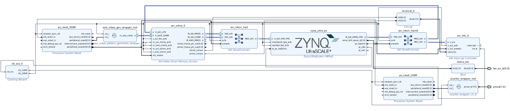

# Forwarding the video to the DP output with Ubuntu running on the PS

## Table of contents
<ol>
    <li><a href="#About-The-Project">About the project</a></li>
    <li><a href="#Hardware-Design">Hardware Design</a></li>
    <li><a href="#Software-design">Software design</a></li>
    <li><a href="#Prerequisites">Prerequisites</a></li>
    <li><a href="#Usage">Usage</a></li>
    <li><a href="#References">References</a></li>
    <li><a href="#Contact">Contact</a></li>
</ol>

## About the project <a id="About-The-Project"></a>

Having generated video from the PL and forwarded it to the video output in the AMD KV260 platform, the next step is to find a way to make the same work when Ubuntu is running on the PS side. In standalone, I had a simple application running on the A53 that configured the Display Port (DP) and its DMA to enable the Live video input (coming from the PL) in the DP controller.

As a first approach, I researched how to perform a configuration similar to the one that I did in standalone but this time from Ubuntu. Unfortunately, I could not find a way to port that baremetal example. Looking into the AMD examples for KV260, I found that the hardware architecture in aibox-reid application is based on the DP Live video input; the software seems to use GStreamer and modetest. I tried reproducing that application from Ubuntu 22.04 running on my KR260 but could not make it (it seems to be intended for Petalinux since doing `modetest -M xlnx` reported
`failed to open device 'xlnx': No such file or directory`). If someone knows a way to make it work from Ubuntu and shares it, I would really appreciate it. In any case, I will jump into Petalinux eventually.

As an alternative straightforward solution, I decided to avoid the DP Live video interface and use Pynq from Ubuntu to forward the video frames generated in the PL towards the video output. This is not efficient at all due to the longer path to go from PL to DP (having to go through the APU) and also to the fact of having a non-real-time OS + Python interpreter just forwarding data; however, it is more than enough for the moment.

## Hardware design <a id="Hardware-Design"></a>

From the FPGA perspective, the Vivado design now does not make usage of DP live interface. Instead, the video generator AXIS output is now received by an `AXI Video DMA or  VDMA` connected to the Processing System (PS) memory via two memory-mapped AXI interfaces (one to send data to the PS memory and one to request data from the PS memory; only the former is used). A general AXI DMA is able to move data between AXIS and AXI devices; the AXI VDMA in particular is intended to move video data as it is intended to work with video frames. This VDMA will forward video frames to the processor uppon request from the latter.

A diagram of the general interconnection system in the Zynq Ultrascale+ is shown below:


The video frames flow from the video generator in the FPGA to the main processor through DDR (orange arrows), operation that is performed by the VDMA when requested by the processor (green arrows representing the path followed by those control commands). This is highlighted below:


The resulting Vivado block diagram is shown below.



## Software design <a id="Software-design"></a>

From the processor perspective, it now runs Ubuntu 22.04, on top of which I use Pynq to ease the PL-PS interaction. The software tasks are simple: 1) configure the DisplayPort (DP) channel and the AXI VDMA implemented in the PL and 2) perform requests to the VDMA to bring frames one by one from the PL, forwarding each to the DP.

## Prerequisites <a id="Prerequisites"></a>

- [AMD Vivado Design Suite](https://www.xilinx.com/products/design-tools/vivado.html) for generating the project, the output artefacts, programming the FPGA, etc.
- [cocotb](https://www.cocotb.org/) as testbenching framework.
- [Questa advanced simulator](https://eda.sw.siemens.com/en-US/ic/questa/simulation/advanced-simulator/) as simulator. Opensource alternatives such as [GHDL](https://github.com/ghdl/ghdl) + [gtkwave](https://github.com/gtkwave/gtkwave) are also good options (they would require minor modifications in the test Makefile).
- [AMD KV260](https://www.xilinx.com/products/som/kria/kv260-vision-starter-kit.html)
- External monitor
- HDMI or DisplayPort cable connecting the external monitor and the KV260.

## Usage <a id="Usage"></a>

**Vivado Project: configuration**:

Configure the video resolution of the video generator through the `rtl/axis_video_pattern_generator_wrapper.vhd` parameters (originally set up to 1080p).

**Vivado Project: build the project and generate bitstream and xsa platform file**:

```
cd output
source /opt/Xilinx/Vivado/2022.1/settings64.sh
make # build the Vivado project and generate bitstream and xsa
make vivado # build the Vivado project and opens it from Vivado GUI. Parameters and configuration can be changed manually in this way.
```

See `output/Makefile` and `ips/platform.tcl` for more details about usage and parameters.

**Software: Ubuntu and Pynq**:

1) Set up the KV260 with Ubuntu as explained [here](https://www.xilinx.com/products/som/kria/kv260-vision-starter-kit/kv260-getting-started-ubuntu/setting-up-the-sd-card-image.html)

2) Install Pynq from Ubuntu running on the KV260:
```
git clone https://github.com/Xilinx/Kria-PYNQ.git
cd Kria-PYNQ/
sudo bash install.sh -b KV260
```

3) Copy `sw/video_forwarder.py` and the `xsa` file generated from Vivado in the previous step to the kv260. Update path to xsa in the python script if they are not located under the same path. In `video_forwarder.py`, configure the video resolution by modifying `Video Mode` of `vdma` and `displayport` as required (originally set up to 1080p). 

4) Run the script as follows:

```
sudo su
source /etc/profile.d/pynq_venv.sh
python3 video_forwarder.py
```

The video generator output should appear now in the external screen:


## References <a id="References"></a>

- [Zynq UltraScale+ Device Technical Reference Manual](https://docs.xilinx.com/r/en-US/ug1085-zynq-ultrascale-trm). In particular, section `DisplayPort Controller` provides relevant information on the underlying hardware in charge of controlling the video output.
- [Kria KV260 Vision AI Starter Kit User Guide (UG1089)](https://docs.xilinx.com/r/en-US/ug1089-kv260-starter-kit/Summary)
- [Kria KV260 Vision AI Starter Kit Data Sheet(DS986)](https://docs.xilinx.com/r/en-US/ds986-kv260-starter-kit/Summary)
- [Kria KV260 Vision AI Starter Kit Applications](https://xilinx.github.io/kria-apps-docs/kv260/2022.1/build/html/index.html)
- [Steps to set up the KV260 board and Ubuntu](https://www.xilinx.com/products/som/kria/kv260-vision-starter-kit/kv260-getting-started-ubuntu/setting-up-the-sd-card-image.html)
- [Kria SOM Carrier Card Design Guide (UG1091)](https://docs.xilinx.com/r/en-US/ug1091-carrier-card-design/MIO-Signals)
- [Kria K26 SOM Data Sheet(DS987)](https://docs.xilinx.com/r/en-US/ds987-k26-som/Overview)
- [AMD Video Series and Blog Posts](https://support.xilinx.com/s/question/0D52E00006hpsS0SAI/xilinx-video-series-and-blog-posts?language=en_US)
- [AMD AXI VDMA documentation](https://docs.xilinx.com/r/en-US/pg020_axi_vdma)
- [Pynq documentation](https://pynq.readthedocs.io/en/v2.1/getting_started.html)

## Contact <a id="Contact"></a>

[![LinkedIn][linkedin-shield]][linkedin-url]


<p align="right">(<a href="#top">back to top</a>)</p>

<!-- README built based on this nice template: https://github.com/othneildrew/Best-README-Template -->

<!-- MARKDOWN LINKS & IMAGES -->

[linkedin-shield]: https://img.shields.io/badge/LinkedIn-0077B5?style=for-the-badge&logo=linkedin&logoColor=white
[linkedin-url]: https://www.linkedin.com/in/juan-manuel-reina-mu%C3%B1oz-56329b130/
